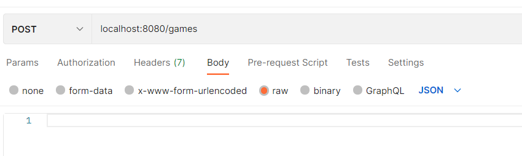
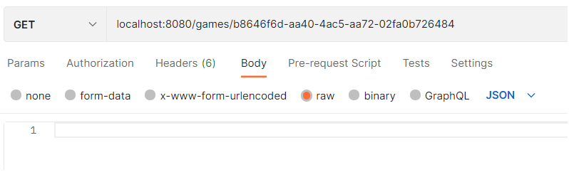
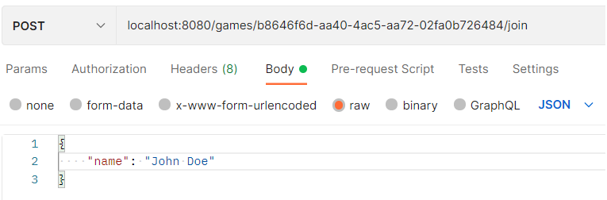
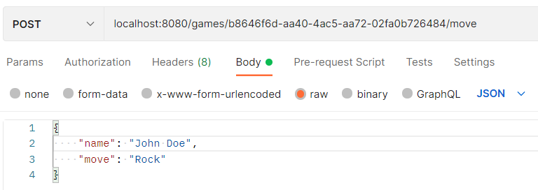

# Rock Paper Scissor
------
In this application, a rock-paper-scissor game is implemented. Every game has an unique id and the id is used join the game. The id can be shared between two players to join the game. When a move is made, a player cannot change it.

### Getting Started
----
Before running the application, some requeriements are needed:
- JDK and JRE 17
- Maven 3.8.3

The application also run Spring Boot 2.5.6.

To build the application, run the following command from the project's root directoery:  
<code>mvn clean install</code>

To start the local server and run the application, run the following command from the project's root directory: 
<code>mvn spring-boot:run</code>

### API-design
----
#### POST api/games
Creates a new game and returns a game-id.

##### Example of return
<code>{
    "game_id": "38cd881c-a68b-49cc-8924-73b6e07688b7"
}</code>

#### GET api/games/{id}
Returns the state and information about a game. States that can occur are PlayerOneWon, PlayerTwoWon, Draw, Not_Finished. If a player has joined its name will appear, otherwise No player will show for playerOne and playerTwo. At last each players move will show if the state is not Not_Finished, otherwise they will be set to Hidden.

##### Example of return
<code>{
    "state": "Not_finished",
    "playerOne": "John Doe",
    "playerTwo": "No player",
    "playerOneMove": "Hidden",
    "playerTwoMove": "Hidden"
}</code>

##### Error handling
**400 Bad_Request** - if a specified game id has the wrong format. 
**404 Not_Found** - if a game does not exist.

#### POST api/games/{id}/join
Player joins specified game with a game-id. Define the player name in the request body.

##### Example of JSON body
<code>{"name":"John Doe"}</code>

##### Error handling
**400 Bad_Request** - if a specified game id does not exist. 
**404 Not_Found** - if a game does not exist.  
**412 - Precondition_Failed** - If a third player tries to join.

#### POST api/games/{id}/move
Registers a move a player chooses to do. Define the players name and move in the request body.

##### Example of JSON body
<code>{"name": "John Doe", "move": "Rock"}</code>

##### Error handling
**400 Bad_Request** - if a specified game id does not exist or player trie to do move hidden. 
**404 Not_Found** - if a game does not exist or player does not exist.  
**412 Precondition_Failed** - If a player tries to do a second move.

### Postman examples
----
To start a game, put following in Postman:

To get the state of the game, put following in Postman:

To join a game, put following in Postman:

To make a move in the game, put following in Postman:

